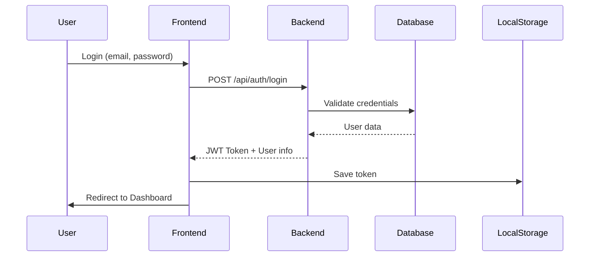
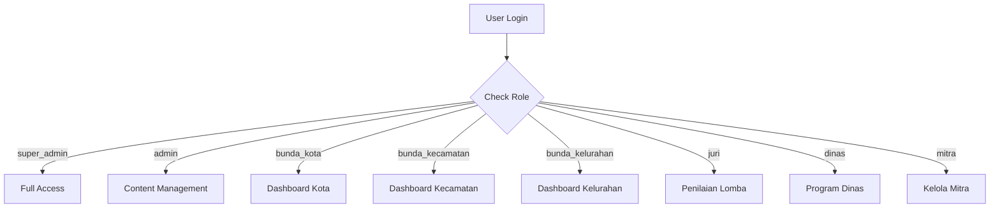
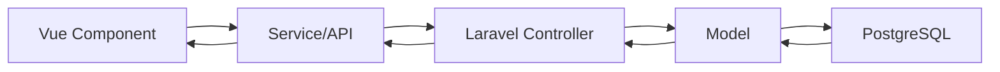

# Struktur Lengkap Website Bunda PAUD Kota Surabaya

## 📋 Overview

Website resmi Bunda PAUD Kota Surabaya - Platform informasi dan layanan PAUD Holistik Integratif.

| Komponen | Teknologi                      |
| -------- | ------------------------------ |
| Frontend | Vue.js 3 + Vite + Tailwind CSS |
| Backend  | Laravel 12 (PHP)               |
| Database | PostgreSQL                     |
| API      | RESTful API                    |

---

## 📁 Struktur Direktori Root

```
Proyek Satu/
├── .github/                  # GitHub workflows
├── .vscode/                  # VS Code settings
├── backend/                  # Laravel Backend
├── frontend/                 # Vue.js Frontend
├── docs/                     # Dokumentasi
├── scripts/                  # Script utilities
├── docker-compose.yml        # Docker config
├── DEPLOYMENT.md             # Panduan deployment
├── README.md                 # Dokumentasi utama
└── SECURITY.md               # Kebijakan keamanan
```

---

# 🎨 FRONTEND (Vue.js)

## Struktur Frontend

```
frontend/
├── public/                   # Static assets
├── src/
│   ├── assets/              # Images, fonts
│   ├── components/          # Reusable components
│   ├── composables/         # Vue composables
│   ├── config/              # Role menu configs
│   ├── data/                # Static data files
│   ├── i18n/                # Internationalization
│   ├── locales/             # Translation files
│   ├── router/              # Vue Router config
│   ├── services/            # API & localStorage services
│   ├── stores/              # Pinia stores
│   ├── views/               # Page components
│   ├── App.vue              # Root component
│   ├── main.js              # Entry point
│   └── style.css            # Global styles
├── index.html
├── package.json
├── tailwind.config.js
└── vite.config.js
```

---

## 📄 Views (94 Files)

### Public Views (14 files)

| File                   | Path            | Deskripsi        |
| ---------------------- | --------------- | ---------------- |
| `HomeView.vue`         | `/`             | Halaman beranda  |
| `BeritaView.vue`       | `/berita`       | Daftar berita    |
| `BeritaDetailView.vue` | `/berita/:slug` | Detail berita    |
| `GaleriView.vue`       | `/galeri`       | Galeri foto      |
| `DokumenView.vue`      | `/dokumen`      | Daftar dokumen   |
| `ProgramView.vue`      | `/program`      | Program kerja    |
| `LayananView.vue`      | `/layanan`      | Layanan PAUD     |
| `KontakView.vue`       | `/kontak`       | Kontak & peta    |
| `PengaduanView.vue`    | `/pengaduan`    | Form pengaduan   |
| `BundaPaudView.vue`    | `/bunda-paud`   | Data Bunda PAUD  |
| `FaqView.vue`          | `/faq`          | FAQ              |
| `SearchView.vue`       | `/cari`         | Pencarian global |
| `ProfilView.vue`       | `/profil`       | Profil container |
| `NotFoundView.vue`     | `/*`            | 404 page         |

### Profil Views (6 files)

| File                  | Path                          | Deskripsi           |
| --------------------- | ----------------------------- | ------------------- |
| `VisiMisiView.vue`    | `/profil/visi-misi`           | Visi & Misi         |
| `TentangView.vue`     | `/profil/tentang`             | Sambutan Bunda PAUD |
| `LogoView.vue`        | `/profil/logo`                | Arti Logo           |
| `TugasFungsiView.vue` | `/profil/tugas-fungsi`        | Tugas & Fungsi      |
| `StrukturView.vue`    | `/profil/struktur-organisasi` | Struktur Organisasi |
| `PenghargaanView.vue` | `/profil/penghargaan`         | Penghargaan         |

### Layanan Views (4 files)

| File                       | Path                          | Deskripsi               |
| -------------------------- | ----------------------------- | ----------------------- |
| `KonsultasiPaudHiView.vue` | `/layanan/konsultasi-paud-hi` | Form konsultasi PAUD HI |
| `PeminjamanGedungView.vue` | `/layanan/peminjaman-gedung`  | Form peminjaman gedung  |
| `PaudBungKarnoView.vue`    | `/layanan/paud-bung-karno`    | Info PAUD Bung Karno    |
| `ProgramPrioritasView.vue` | `/layanan/program-prioritas`  | Program prioritas       |

### Data PAUD Views (21 files)

| File                            | Path                      | Deskripsi                 |
| ------------------------------- | ------------------------- | ------------------------- |
| `RingkasanDataView.vue`         | `/data/ringkasan`         | Ringkasan statistik       |
| `DaftarSekolahPaudView.vue`     | `/data/daftar-sekolah`    | Daftar sekolah PAUD       |
| `AkreditasiPaudView.vue`        | `/data/akreditasi-paud`   | Data akreditasi           |
| `IjinOperasionalView.vue`       | `/data/ijin-operasional`  | Ijin operasional          |
| `ProfilingPaudView.vue`         | `/data/profiling-paud`    | Profiling PAUD            |
| `Gerakan7KaihView.vue`          | `/data/gerakan-7-kaih`    | Gerakan 7 KAIH            |
| `DigitalisasiPaudView.vue`      | `/data/digitalisasi-paud` | Digitalisasi              |
| `SulingjarView.vue`             | `/data/sulingjar`         | Survei Lingkungan Belajar |
| `RaporPendidikanView.vue`       | `/data/rapor-pendidikan`  | Rapor Pendidikan          |
| `ApkAksAtsView.vue`             | `/data/apk-aks-ats`       | APK/AKS/ATS PAUD          |
| `IkdView.vue`                   | `/data/ikd`               | IKD PAUD                  |
| `PaudHiView.vue`                | `/data/paud-hi`           | PAUD HI                   |
| `RevitalisasiPaudView.vue`      | `/data/revitalisasi-paud` | Revitalisasi              |
| `PeraturanView.vue`             | `/data/peraturan`         | Peraturan                 |
| `NpkView.vue`                   | `/data/npk`               | NPK                       |
| `LaporanView.vue`               | `/data/laporan`           | Laporan                   |
| `DataPaudView.vue`              | `/data/paud`              | Data PAUD                 |
| `LembagaPaudView.vue`           | `/data/lembaga-paud`      | Lembaga PAUD              |
| `DaftarIjinOperasionalView.vue` | -                         | Daftar ijin               |
| `ApkAtsPaudView.vue`            | -                         | APK ATS                   |
| `RaporPaudView.vue`             | -                         | Rapor PAUD                |

### Galeri Bunda Views (5 files)

| File                  | Path                         | Deskripsi           |
| --------------------- | ---------------------------- | ------------------- |
| `InfografisView.vue`  | `/galeri-bunda/infografis`   | Infografis          |
| `MajalahBukuView.vue` | `/galeri-bunda/majalah-buku` | Majalah & Buku      |
| `MateriView.vue`      | `/galeri-bunda/materi`       | Materi Pembelajaran |
| `PermainanView.vue`   | `/galeri-bunda/permainan`    | Permainan Edukatif  |
| `BundaTvView.vue`     | `/galeri-bunda/bunda-tv`     | Bunda TV (Video)    |

### Mitra PAUD Views (3 files)

| File                       | Path                      | Deskripsi           |
| -------------------------- | ------------------------- | ------------------- |
| `MitraPaudView.vue`        | `/mitra-paud`             | Daftar Mitra PAUD   |
| `GugasTugasView.vue`       | `/mitra-paud/gugus-tugas` | Gugus Tugas PAUD HI |
| `PendaftaranMitraView.vue` | -                         | Form pendaftaran    |

---

### Admin Views (32 files)

| File                        | Path                      | Deskripsi           |
| --------------------------- | ------------------------- | ------------------- |
| `LoginView.vue`             | `/admin/login`            | Login admin         |
| `DashboardView.vue`         | `/admin/dashboard`        | Dashboard utama     |
| `UserManagementView.vue`    | `/admin/users`            | Manajemen pengguna  |
| `SliderView.vue`            | `/admin/sliders`          | Kelola slider       |
| `ProfileView.vue`           | `/admin/profiles`         | Kelola profil       |
| `PublikasiView.vue`         | `/admin/publikasi`        | Publikasi (10 tabs) |
| `ArticlesView.vue`          | `/admin/articles`         | Kelola berita       |
| `ArticleFormView.vue`       | `/admin/articles/:id`     | Form berita         |
| `CategoriesView.vue`        | `/admin/categories`       | Kelola kategori     |
| `GalleriesView.vue`         | `/admin/galleries`        | Kelola galeri       |
| `DocumentsView.vue`         | `/admin/documents`        | Kelola dokumen      |
| `PeminjamanAdminView.vue`   | `/admin/peminjaman`       | Kelola peminjaman   |
| `KonsultasiAdminView.vue`   | `/admin/konsultasi`       | Kelola konsultasi   |
| `ComplaintsView.vue`        | `/admin/complaints`       | Kelola pengaduan    |
| `BundaPaudAdminView.vue`    | `/admin/bunda-paud`       | Kelola Bunda PAUD   |
| `MitraPaudAdminView.vue`    | `/admin/mitra-paud`       | Kelola Mitra PAUD   |
| `GugasTugasAdminView.vue`   | `/admin/gugus-tugas`      | Kelola Gugus Tugas  |
| `DataPaudAdminView.vue`     | `/admin/data-paud`        | Data PAUD           |
| `SettingsView.vue`          | `/admin/settings`         | Pengaturan          |
| `RealtimeAnalyticsView.vue` | `/admin/analytics`        | Analitik            |
| `TimelineProgramView.vue`   | `/admin/timeline-program` | Timeline Program    |
| `KegiatanAdminView.vue`     | `/admin/kegiatan`         | Kelola Kegiatan     |
| `RekapView.vue`             | `/admin/rekap`            | Rekap Data          |
| `DiagramView.vue`           | `/admin/diagram`          | Diagram Data        |
| `MonitorTransisiView.vue`   | `/admin/monitor-transisi` | Monitor Transisi    |
| `LombaApresiasiView.vue`    | `/admin/lomba-apresiasi`  | Lomba Apresiasi     |
| `BerkasView.vue`            | `/admin/berkas`           | Berkas              |
| `KelompokKerjaView.vue`     | `/admin/kelompok-kerja`   | Kelompok Kerja      |
| `ProgramKerjaBundaView.vue` | `/admin/program-kerja`    | Program Kerja       |
| `SekolahView.vue`           | `/admin/sekolah`          | Data Sekolah        |
| `VaksinasiView.vue`         | `/admin/vaksinasi`        | Data Vaksinasi      |
| `MonitorAnakView.vue`       | `/admin/monitoring-anak`  | Monitoring Anak     |

### Role-Specific Views (9 files)

#### Juri Role (2 files)

| File                    | Path                    | Deskripsi       |
| ----------------------- | ----------------------- | --------------- |
| `JuriDashboardView.vue` | `/admin/juri/dashboard` | Dashboard Juri  |
| `PenilaianJuriView.vue` | `/admin/juri/penilaian` | Penilaian Lomba |

#### Dinas Role (4 files)

| File                     | Path                         | Deskripsi          |
| ------------------------ | ---------------------------- | ------------------ |
| `PelatihanDinasView.vue` | `/admin/dinas/pelatihan`     | Pelatihan PAUD     |
| `EduCityTourView.vue`    | `/admin/dinas/edu-city-tour` | Edu City Tour      |
| `FasilitasiView.vue`     | `/admin/dinas/fasilitasi`    | Fasilitasi Program |
| `DataVaksinasiView.vue`  | `/admin/dinas/vaksinasi`     | Data Vaksinasi     |

#### Mitra Role (3 files)

| File                    | Path                    | Deskripsi      |
| ----------------------- | ----------------------- | -------------- |
| `DaftarAnggotaView.vue` | `/admin/mitra/anggota`  | Daftar Anggota |
| `KegiatanMitraView.vue` | `/admin/mitra/kegiatan` | Kegiatan Mitra |
| `LaporanMitraView.vue`  | `/admin/mitra/laporan`  | Laporan Mitra  |

---

## 🧩 Components (19 files)

### Layout Components (7 files)

| File                   | Deskripsi           |
| ---------------------- | ------------------- |
| `AdminLayout.vue`      | Layout admin panel  |
| `Navbar.vue`           | Navigasi utama      |
| `Footer.vue`           | Footer website      |
| `DataLayout.vue`       | Layout halaman data |
| `DataSidebar.vue`      | Sidebar menu data   |
| `ProfilSidebar.vue`    | Sidebar profil      |
| `MitraPaudSidebar.vue` | Sidebar mitra       |

### Common Components (3 files)

Located in `components/common/`

### UI Components (4 files)

Located in `components/ui/`

### Other Components

| File                   | Deskripsi        |
| ---------------------- | ---------------- |
| `LanguageSwitcher.vue` | Ganti bahasa     |
| `LiveChat.vue`         | Live chat widget |
| `SupportWidget.vue`    | Support widget   |
| `HelloWorld.vue`       | Sample component |

---

## ⚙️ Services (4 files)

| File               | Deskripsi                         |
| ------------------ | --------------------------------- |
| `api.js`           | Axios instance & API calls        |
| `index.js`         | Service exports & API integration |
| `localStorage.js`  | LocalStorage management           |
| `notifications.js` | Notification service              |

---

## 🗂️ Stores (2 files)

| File        | Deskripsi                  |
| ----------- | -------------------------- |
| `app.js`    | App state (dark mode, etc) |
| `slider.js` | Slider state management    |

---

## ⚙️ Config (6 files)

| File            | Deskripsi           |
| --------------- | ------------------- |
| `index.js`      | Role configurations |
| `adminMenus.js` | Admin sidebar menu  |
| `bundaMenus.js` | Bunda PAUD menu     |
| `juriMenus.js`  | Juri menu           |
| `dinasMenus.js` | Dinas menu          |
| `mitraMenus.js` | Mitra menu          |

---

# ⚙️ BACKEND (Laravel)

## Struktur Backend

```
backend/
├── app/
│   ├── Console/             # Artisan commands
│   ├── Exports/             # Excel exports
│   ├── Http/
│   │   ├── Controllers/Api/ # API Controllers (29 files)
│   │   └── Middleware/
│   ├── Mail/                # Email templates
│   ├── Models/              # Eloquent models (22 files)
│   ├── Providers/           # Service providers
│   └── Services/            # Business logic
├── bootstrap/
├── config/                  # Configuration files
├── database/
│   ├── factories/           # Model factories
│   ├── migrations/          # DB migrations (30 files)
│   └── seeders/             # DB seeders (22 files)
├── public/
├── resources/
├── routes/
│   ├── api.php              # API routes
│   ├── console.php
│   └── web.php
├── storage/
├── tests/
├── .env                     # Environment config
├── artisan
├── composer.json
└── package.json
```

---

## 📊 Models (22 files)

| Model            | Table       | Deskripsi           |
| ---------------- | ----------- | ------------------- |
| `User.php`       | users       | Pengguna sistem     |
| `Role.php`       | roles       | Role/peran pengguna |
| `Article.php`    | articles    | Berita & artikel    |
| `Category.php`   | categories  | Kategori berita     |
| `Gallery.php`    | galleries   | Galeri foto         |
| `Document.php`   | documents   | Dokumen             |
| `Slider.php`     | sliders     | Slider homepage     |
| `Profile.php`    | profiles    | Profil konten       |
| `Complaint.php`  | complaints  | Pengaduan           |
| `BundaPaud.php`  | bunda_paud  | Data Bunda PAUD     |
| `MitraPaud.php`  | mitra_paud  | Data Mitra PAUD     |
| `GugusTugas.php` | gugus_tugas | Gugus Tugas         |
| `Peminjaman.php` | peminjaman  | Peminjaman gedung   |
| `Konsultasi.php` | konsultasi  | Konsultasi PAUD     |
| `Infografis.php` | infografis  | Infografis          |
| `Materi.php`     | materi      | Materi pembelajaran |
| `Majalah.php`    | majalah     | Majalah & buku      |
| `BundaTv.php`    | bunda_tv    | Video Bunda TV      |
| `Peraturan.php`  | peraturan   | Peraturan           |
| `Npk.php`        | npk         | NPK                 |
| `Laporan.php`    | laporan     | Laporan             |
| `AuditLog.php`   | audit_logs  | Log aktivitas       |

---

## 🎮 Controllers (29 files)

| Controller               | Routes            | Deskripsi               |
| ------------------------ | ----------------- | ----------------------- |
| `AuthController`         | /auth/\*          | Login, logout, register |
| `UserController`         | /users/\*         | CRUD pengguna           |
| `ArticleController`      | /articles/\*      | CRUD artikel            |
| `CategoryController`     | /categories/\*    | CRUD kategori           |
| `GalleryController`      | /galleries/\*     | CRUD galeri             |
| `DocumentController`     | /documents/\*     | CRUD dokumen            |
| `SliderController`       | /sliders/\*       | CRUD slider             |
| `ProfileController`      | /profiles/\*      | CRUD profil             |
| `ComplaintController`    | /complaints/\*    | CRUD pengaduan          |
| `BundaPaudController`    | /bunda-paud/\*    | CRUD Bunda PAUD         |
| `MitraPaudController`    | /mitra-paud/\*    | CRUD Mitra PAUD         |
| `GugusTugasController`   | /gugus-tugas/\*   | CRUD Gugus Tugas        |
| `PeminjamanController`   | /peminjaman/\*    | CRUD peminjaman         |
| `KonsultasiController`   | /konsultasi/\*    | CRUD konsultasi         |
| `InfografisController`   | /infografis/\*    | CRUD infografis         |
| `MateriController`       | /materi/\*        | CRUD materi             |
| `MajalahController`      | /majalah/\*       | CRUD majalah            |
| `BundaTvController`      | /bunda-tv/\*      | CRUD Bunda TV           |
| `PeraturanController`    | /peraturan/\*     | CRUD peraturan          |
| `NpkController`          | /npk/\*           | CRUD NPK                |
| `LaporanController`      | /laporan/\*       | CRUD laporan            |
| `SettingsController`     | /settings/\*      | Pengaturan              |
| `AnalyticsController`    | /analytics/\*     | Data analitik           |
| `FileUploadController`   | /upload/\*        | Upload file             |
| `ExportController`       | /export/\*        | Export data             |
| `SearchController`       | /search/\*        | Pencarian               |
| `ReportController`       | /reports/\*       | Laporan                 |
| `NotificationController` | /notifications/\* | Notifikasi              |
| `HealthController`       | /health           | Health check            |

---

## 🗃️ Database Migrations (30 files)

| Migration                             | Table                    | Deskripsi          |
| ------------------------------------- | ------------------------ | ------------------ |
| `create_users_table`                  | users                    | Tabel pengguna     |
| `create_cache_table`                  | cache                    | Cache Laravel      |
| `create_jobs_table`                   | jobs                     | Queue jobs         |
| `create_bunda_paud_table`             | bunda_paud               | Bunda PAUD Kec/Kel |
| `create_personal_access_tokens_table` | personal_access_tokens   | API tokens         |
| `create_articles_table`               | articles                 | Berita             |
| `create_galleries_table`              | galleries                | Galeri             |
| `create_documents_table`              | documents                | Dokumen            |
| `create_complaints_table`             | complaints               | Pengaduan          |
| `create_sliders_table`                | sliders                  | Slider             |
| `create_profiles_table`               | profiles                 | Profil konten      |
| `create_settings_table`               | settings                 | Pengaturan         |
| `create_faq_table`                    | faq                      | FAQ                |
| `create_programs_table`               | programs                 | Program kerja      |
| `create_data_paud_tables`             | sekolah, akreditasi, dsb | Data PAUD          |
| `create_roles_table`                  | roles                    | Role pengguna      |
| `add_role_to_users_table`             | users                    | Tambah role_id     |
| `create_categories_table`             | categories               | Kategori           |
| `create_peminjaman_table`             | peminjaman               | Peminjaman         |
| `create_konsultasi_table`             | konsultasi               | Konsultasi         |
| `create_infografis_table`             | infografis               | Infografis         |
| `create_materi_table`                 | materi                   | Materi             |
| `create_majalah_table`                | majalah                  | Majalah            |
| `create_bunda_tv_table`               | bunda_tv                 | Bunda TV           |
| `create_peraturan_table`              | peraturan                | Peraturan          |
| `create_npk_table`                    | npk                      | NPK                |
| `create_laporan_table`                | laporan                  | Laporan            |
| `create_mitra_paud_table`             | mitra_paud               | Mitra PAUD         |
| `create_gugus_tugas_table`            | gugus_tugas              | Gugus Tugas        |
| `create_audit_logs_table`             | audit_logs               | Audit logs         |

---

## 🌱 Seeders (22 files)

| Seeder             | Deskripsi          |
| ------------------ | ------------------ |
| `DatabaseSeeder`   | Main seeder        |
| `AdminSeeder`      | Data admin default |
| `UserSeeder`       | Data pengguna      |
| `RoleSeeder`       | Data role          |
| `ArticleSeeder`    | Contoh artikel     |
| `CategorySeeder`   | Kategori default   |
| `GallerySeeder`    | Contoh galeri      |
| `DocumentSeeder`   | Contoh dokumen     |
| `SliderSeeder`     | Slider default     |
| `ProfileSeeder`    | Konten profil      |
| `ProgramSeeder`    | Program kerja      |
| `BundaPaudSeeder`  | Data Bunda PAUD    |
| `MitraPaudSeeder`  | Data Mitra PAUD    |
| `GugusTugasSeeder` | Data Gugus Tugas   |
| `DataPaudSeeder`   | Data PAUD          |
| `InfografisSeeder` | Infografis         |
| `MateriSeeder`     | Materi             |
| `MajalahSeeder`    | Majalah            |
| `BundaTvSeeder`    | Video              |
| `PeraturanSeeder`  | Peraturan          |
| `NpkSeeder`        | NPK                |
| `LaporanSeeder`    | Laporan            |

---

# 🔄 Alur Sistem

## Authentication Flow



## Role-Based Access



## Data Flow



---

# 🚀 Cara Menjalankan

## Prerequisites

- Node.js 18+
- PHP 8.2+
- PostgreSQL 15+
- Composer

## Backend

```bash
cd backend
composer install
cp .env.example .env
# Edit .env untuk database
php artisan key:generate
php artisan migrate:fresh --seed
php artisan serve --port=8000
```

## Frontend

```bash
cd frontend
npm install
npm run dev
```

## Akses

- Frontend: http://localhost:5173
- Backend API: http://localhost:8000/api
- Admin: http://localhost:5173/admin/login

---

# 👥 Role & Permission

| Role            | Code              | Akses               |
| --------------- | ----------------- | ------------------- |
| Super Admin     | `super_admin`     | Semua fitur         |
| Admin           | `admin`           | Content management  |
| Bunda PAUD Kota | `bunda_kota`      | Dashboard kota      |
| Bunda PAUD Kec  | `bunda_kecamatan` | Dashboard kecamatan |
| Bunda PAUD Kel  | `bunda_kelurahan` | Dashboard kelurahan |
| Juri            | `juri`            | Penilaian lomba     |
| Dinas           | `dinas`           | Program dinas       |
| Mitra           | `mitra`           | Kelola mitra        |

---

# 📊 Statistik Codebase

| Komponen            | Jumlah         |
| ------------------- | -------------- |
| Vue Views           | 94 files       |
| Vue Components      | 19 files       |
| Laravel Controllers | 29 files       |
| Eloquent Models     | 22 files       |
| DB Migrations       | 30 files       |
| DB Seeders          | 22 files       |
| API Routes          | 100+ endpoints |
| Total Lines of Code | ~50,000+       |
